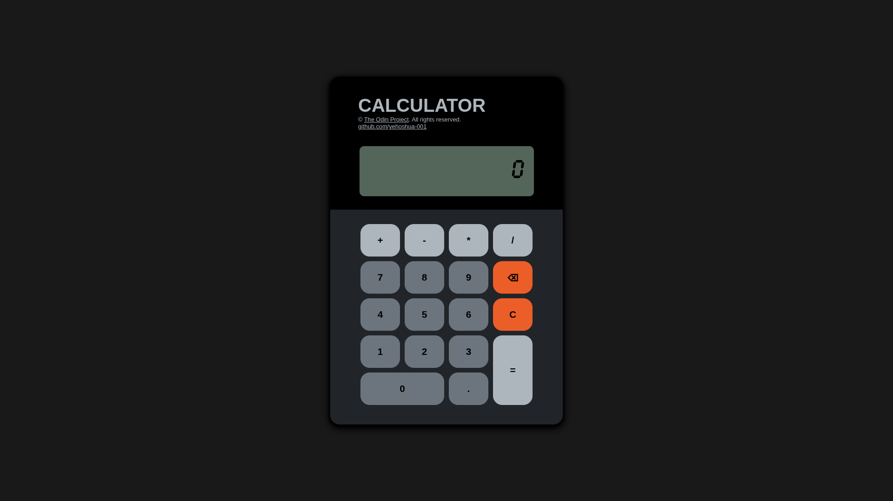

# Project: Calculator | The Odin Project

## Description
This project is an on-screen or browser version of calculator that calculates basic math operations. The purpose of this project is to apply and demonstrate the skills I learned throughout the Foundations Course of [The Odin Project](https://www.theodinproject.com/about) which includes HTML, CSS, and JavaScript.

## Demo

## Sample

## Access
Method 1
- Access the project through its github-page: https://yehoshua-001.github.io/calculator/

Method 2
1. Clone the repository in your local computer.
2. Open the 'index.html' file in your web browser.

## Reference
<strong>CDN Font</strong> &mdash; https://www.cdnfonts.com/
